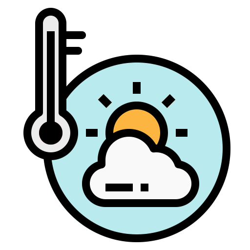

</header>
  

  <h1 align="center"> Weather Search</h1>
  
 
    <strong>
      Este repositório foi criado a partir da ideia de criar uma aplicação Web consumindo uma API fornecida pela OpenWeather
      <a href="https://openweathermap.org">openweathermap.org</a> utilizando do framework Angular. Inicialmente a primeira versão projeto foi feita para uma entrevista de             emprego usando de um protótipo disponibilizado pela <a href="https://www.actionlabs.com.br/">www.actionlabs.com.br</a> mas com o passar do tem tive a vontade de recriar         esse projeto utilizando de um protótipo feito por min a fim de me aprofundar nos estudos 
    </strong> 
  

  <h2>Forecast V1</h2>
  
 
    <a href="#status_v1">Status do projeto</a> •
    <a href="#preview">Preview</a> •
    <a href="#instalacao">Instalação</a> •
    <a href="#tecnologias">Tecnologias</a> •
  

  <h2>Forecast V2</h2>
  
 
    <a href="#status_v2">Status do projeto</a> •
    <a href="#preview_v2">Preview</a> •
    <a href="#instalacao_v2">Instalação</a> •
    <a href="#tecnologias_v2">Tecnologias</a> •
  

  

</header>
<main>
  

    <h3 align="center">Status Forecast_V1</h3>
    <h4 align="center">
      - O projeto está finalizado!
    </h4>
  

  

    <h3 align="center">Preview</h3>
    
  

  

    <h3 align="center">Instalação</h3>
    
 :warning: É necessário ter o <a href="https://nodejs.org/en/" target="_blank">Node.JS</a> instalado para seguir os próximos passos; 

  <ul><li>Front-end</li></ul>

    # Clone the repository
    $ https://github.com/Caio0501/Weather-search.git
    
    # Install all the dependencies
    $ npm install

    # Start the application
    $ npm start

  

    <h3 align="center">Tecnologias utilizadas</h3>
    <ul>
      <li>Angular 10</li>
      <li>Typescript</li>
    </ul>
  

</main>
